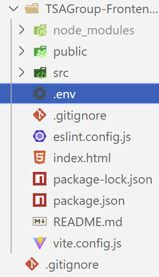
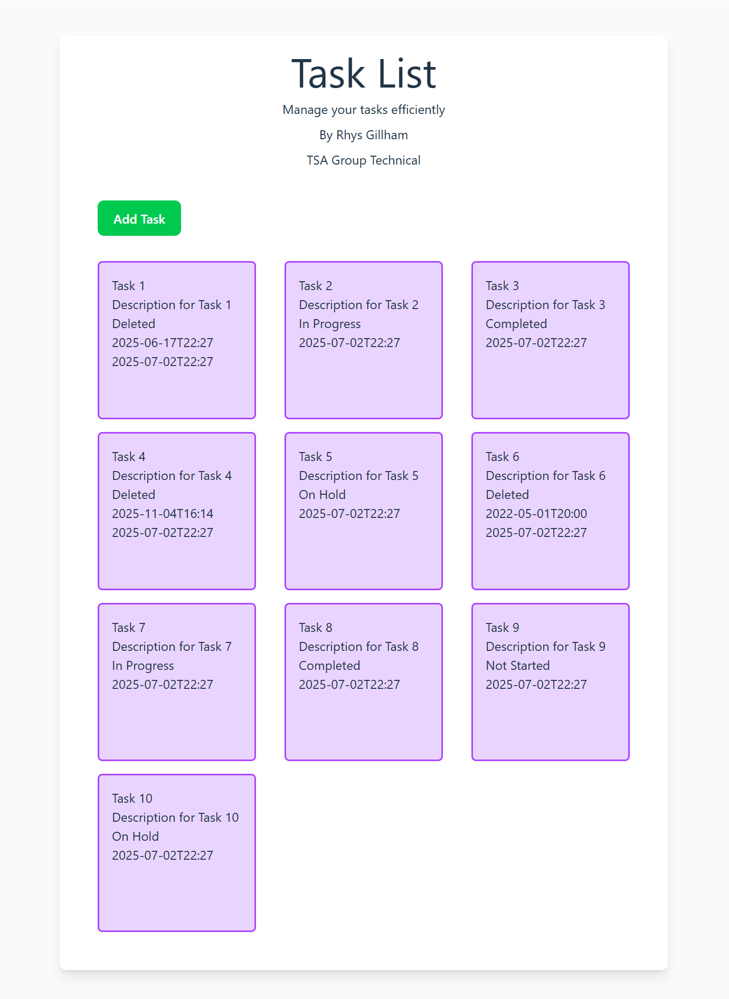

# TSAGroup-App

## Installation

Installation of the application requires several components to be installed onto the system:

- NodeJS
- .NET & Jetbrains Rider

Missing from the project is a `.env` file and this file requires the following information:
`
VITE_API_URL=http://localhost:5230/api
`. This file should be in the root directory of the frontend application



The projects frontend requires Node, once installed run the command
``` bash
npm install
```
This will install the required packages to allow for the project to run
## Starting

### Frontend
To run the project you must run
```bash 
npm run dev
```

Navigating to 
```
http:localhost:5173
```
You should see the landing page



### Backend

With .NET & Rider installed, selecting run from within the IDE will start the backend server.
