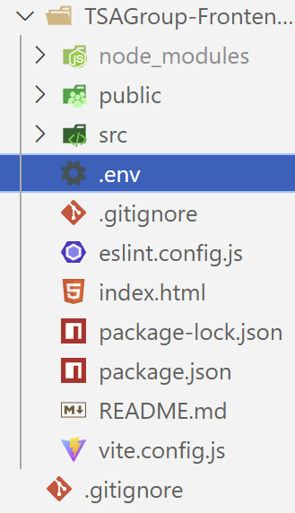

# TSAGroup-App

## Installation

Installation of the application requires several components to be installed onto the system:

- NodeJS
- .NET

Missing from the project is a `.env` file and this file requires the following information:
`
VITE_API_URL=http://localhost:5230/api
`. This file should be in the root directory of the frontend application

