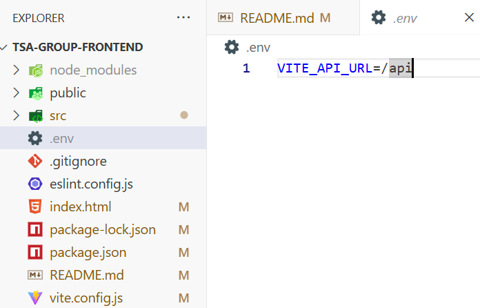

# TSA Group - Tech

This is the frontend component of the TSA Tech, it requires NodeJS installed to run as NPM pulls the packages required.

## Installation
This project requires a `.env` file that contains the URL of the server, it should resemble:
`
VITE_API_URL=/api`
It exists within root directory of the project alongside public, src, and the node_modules.

## Requirements

The key requirements that this application meets is basic validation, and a toast animation for success or failure depending on the outcome of the request to the server.